# Рендеры WPF-панели

## Этап 4: «Разное» и групповое редактирование

`stage4-*.png` получены из настоящего WPF `UserControl` на Windows **net48**,
целевом runtime AutoCAD 2021. Источник:
[CI, commit 0c7a3cb](https://github.com/konard/veb86-acadPaletteSetXDATA/actions/runs/37511644763),
артефакт `wpf-renders/net48`. Те же проверки проходят для .NET 8.
Источник данных — снимки с mock-записью через настоящий `XDataPatch`, без AutoCAD.

| До: отдельный объект, только чтение | После: общие свойства и Разное |
| --- | --- |
| 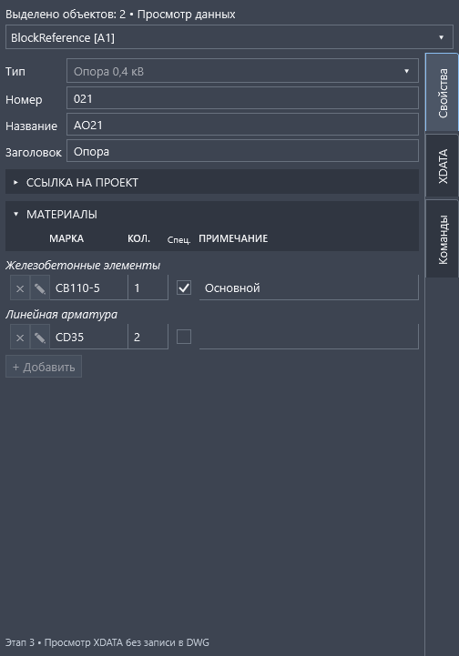 | 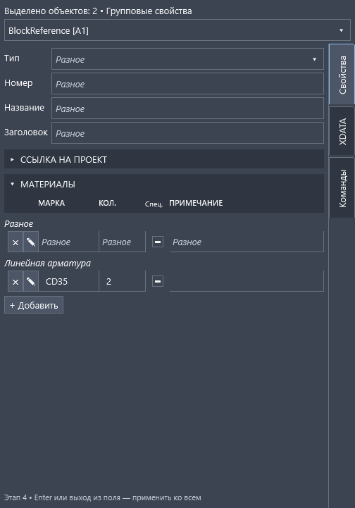 |

| Разное, светлая тема | Подтверждённые групповые изменения |
| --- | --- |
| 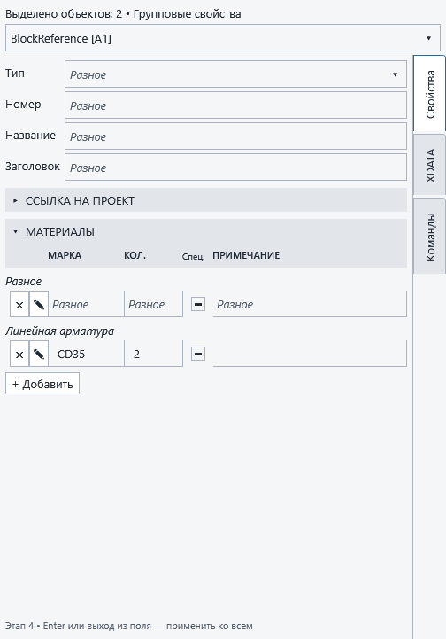 | 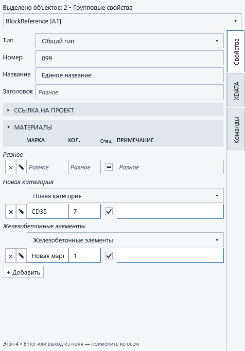 |

Проверяются настоящий ввод/подтверждение через Enter/фокус, отсутствие записи при
посещении поля без ввода, полная видимость плейсхолдера количества, сохранение фокуса
при вводе категории, перегруппировка после подтверждения, флаг и material add/rename/delete.
Нативная рамка PaletteSet и запись/Undo в живой DWG проверяются отдельно в AutoCAD.

## Этап 3: выбор и чтение XDATA/XRecord

`stage3-*.png` получены из настоящего WPF `UserControl` на Windows в режиме чтения.
Источник: [CI, commit 685632c](https://github.com/veb86/acadPaletteSetXDATA/actions/runs/37477965743),
артефакт `wpf-renders/net8`. Те же проверки выполняются на .NET Framework 4.8,
который используется целевой сборкой AutoCAD 2021. AutoCAD в CI не установлен:
рендеры используют снимки двух примитивов, без нативной рамки PaletteSet.

| Тёмная тема | Светлая тема |
| --- | --- |
|  | 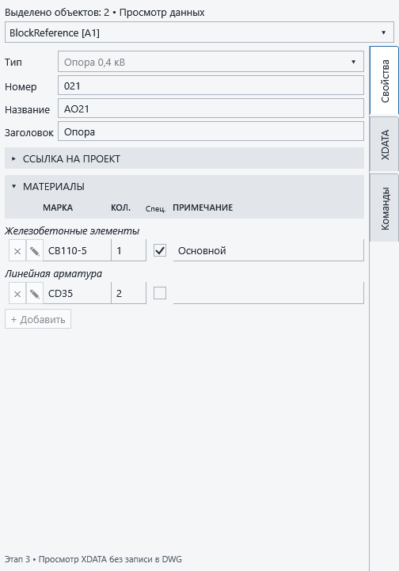 |
| 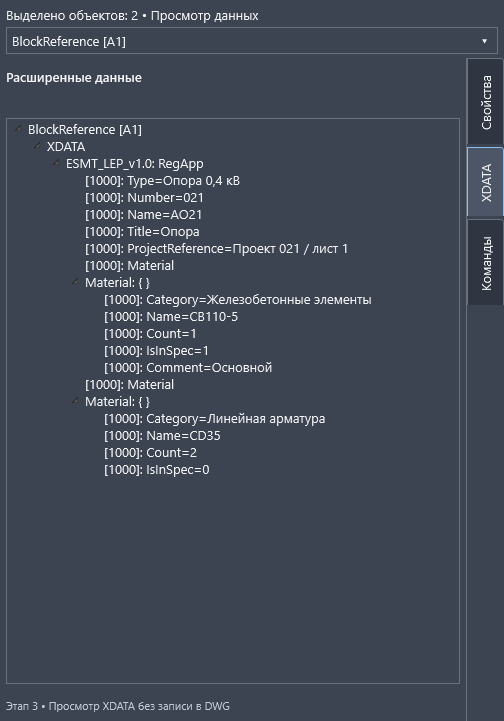 | 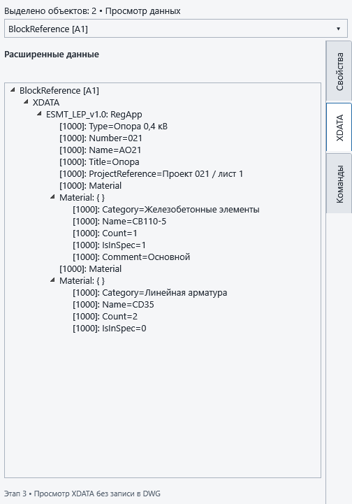 |

| Без выделения: редактор неактивен | Один объект | XML XRecord |
| --- | --- | --- |
| 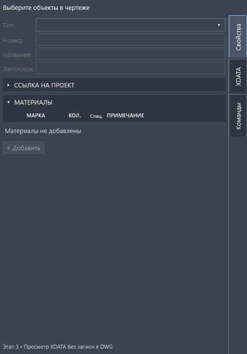 | 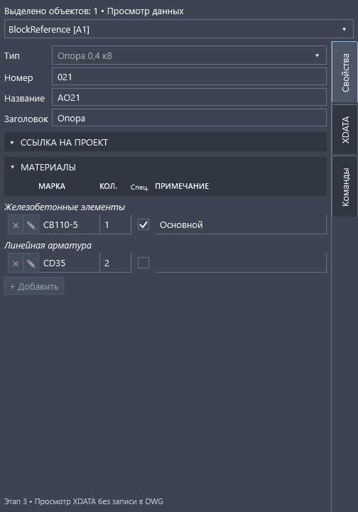 | 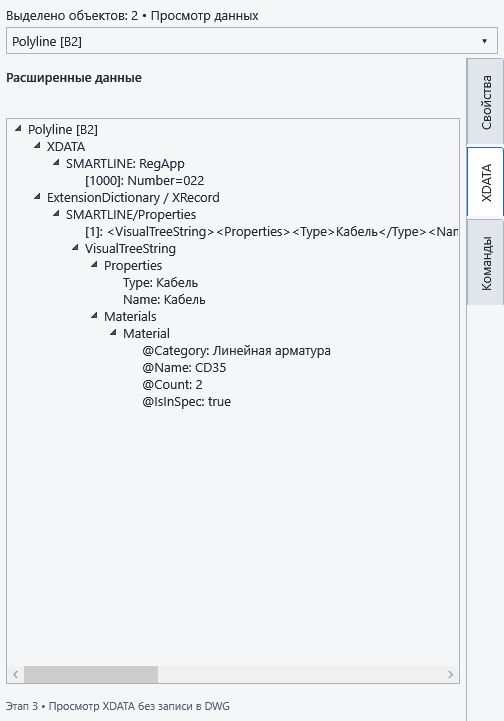 |

Проверка подписи выбранного объекта выявила отсутствие `SelectionBoxItemTemplate`
в общем шаблоне ComboBox. До исправления выводилось CLR-имя модели, после — тип
примитива и handle. Smoke-тест на commit `ef10578` воспроизводит ошибку;
проверка обеих подписей при смене объекта выполняется в обеих темах и платформах.

| До исправления подписи | После |
| --- | --- |
| 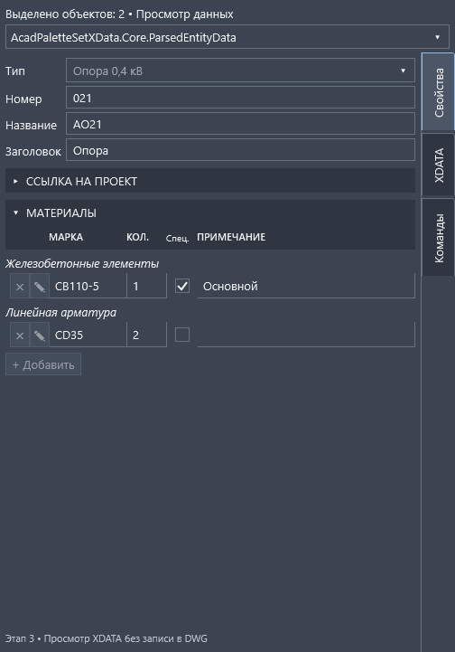 |  |

## Этап 2: свойства и материалы

`stage2-*.png` созданы настоящим WPF `UserControl` на Windows, включая пустой
черновик, три вкладки в обеих темах, раскрытый проект и узкую панель с прокруткой.
В обычных изображениях инструмент предпросмотра использует демонстрационные
материалы из изображения ТЗ; сам плагин начинает с пустого черновика.

Источник: [CI, commit ad6f6fe](https://github.com/konard/veb86-acadPaletteSetXDATA/actions/runs/37452804483),
артефакт `wpf-renders/net8`. Тот же сценарий проверяет .NET Framework 4.8.
Генератор: `experiments/AcadPaletteSetXData.WpfSmoke`; команды — в основном README.
Изображения показывают WPF-содержимое без нативной рамки AutoCAD.

| Тёмная тема | Светлая тема |
| --- | --- |
| 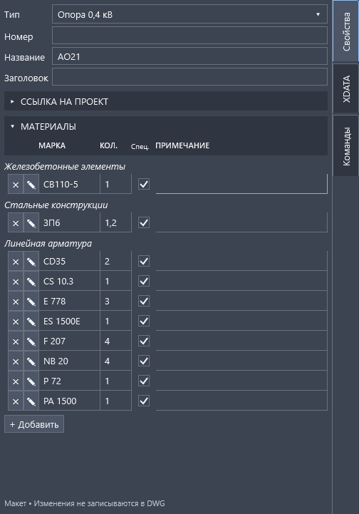 | 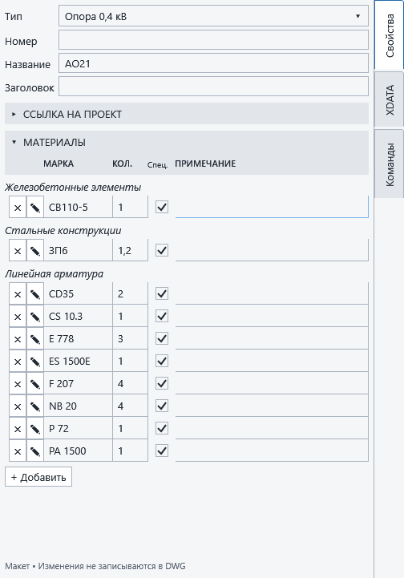 |
| 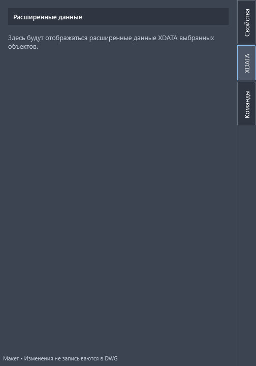 | 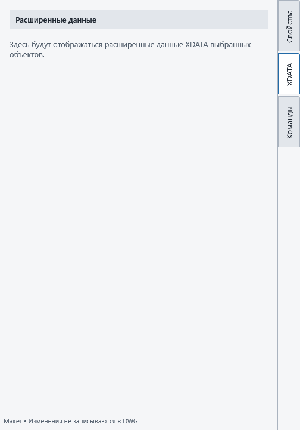 |
| 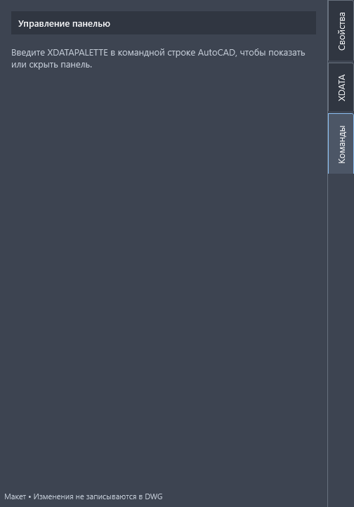 | 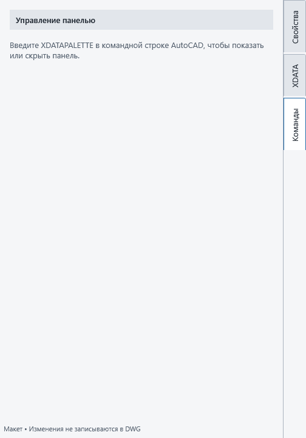 |

| Пустой черновик | Ссылка на проект | Минимальный размер, прокрутка |
| --- | --- | --- |
| 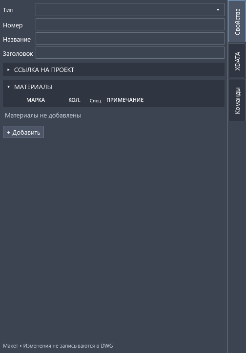 | 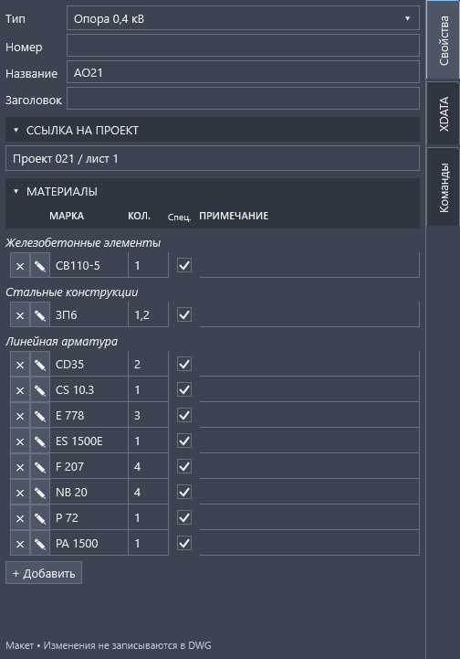 | 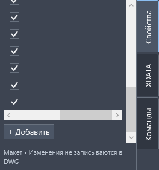 |

## Этап 1: исходный каркас

Изображения `stage1-<тема>-<вкладка>.png` созданы настоящим WPF `UserControl`
на Windows, а не отдельным макетом. Индексы вкладок: `0` — «Свойства»,
`1` — «XDATA», `2` — «Команды». Здесь сохранены рендеры .NET 8; тот же сценарий
успешно выполнен и на .NET Framework 4.8.

Источник: [CI, commit 378f034](https://github.com/konard/veb86-acadPaletteSetXDATA/actions/runs/37442186241),
артефакт `wpf-renders/net8`. Генератор: `experiments/AcadPaletteSetXData.WpfSmoke`.
Изображения показывают только содержимое палитры, без нативной рамки AutoCAD.

| Тёмная тема | Светлая тема |
| --- | --- |
| 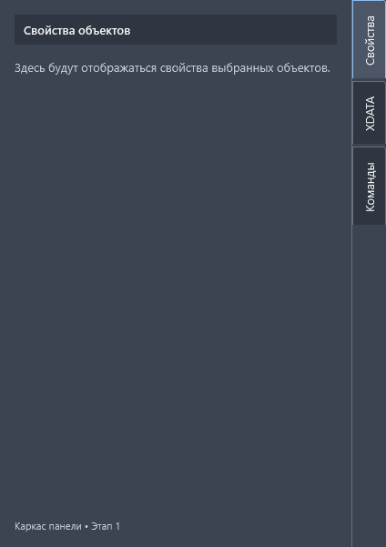 | 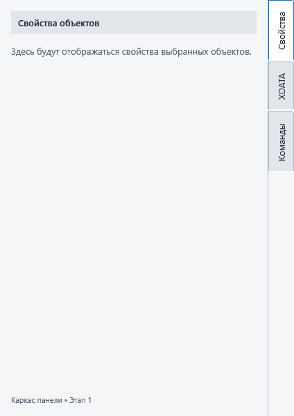 |
| 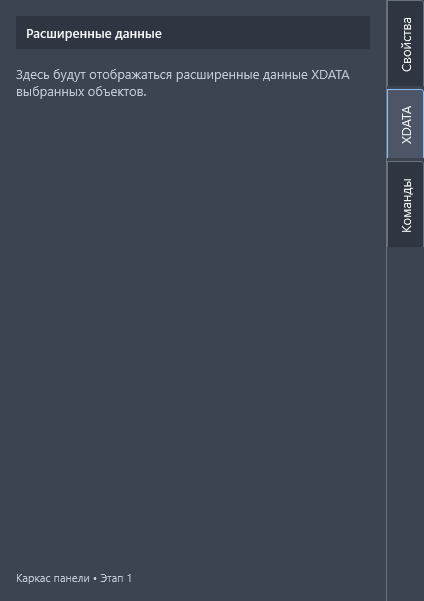 | 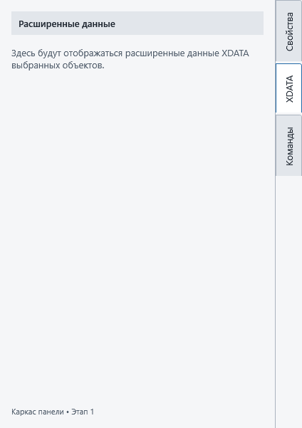 |
| 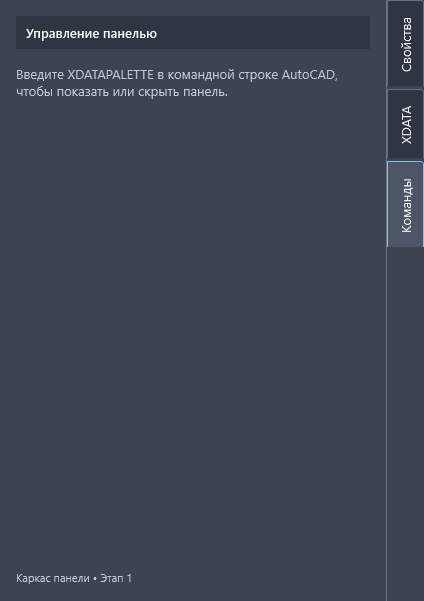 | 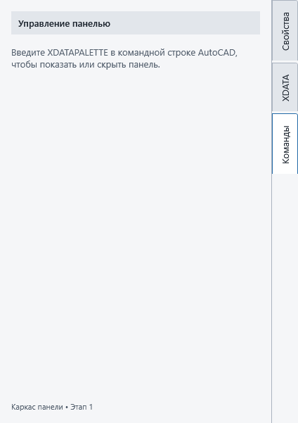 |
